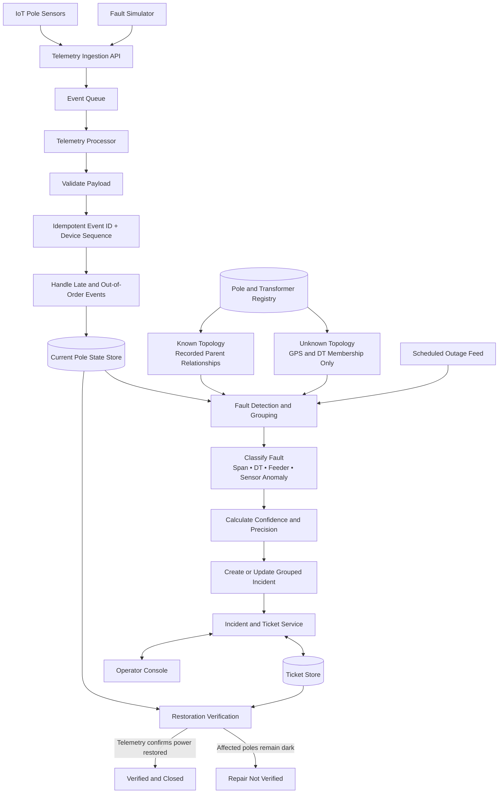
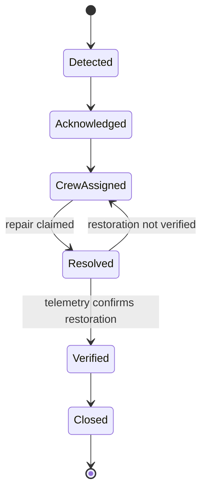

# Architecture

## 1. Purpose

The system converts binary pole telemetry into a trustworthy outage incident.

Its primary output is one operator-facing ticket containing:

* Probable failed asset: span, distribution transformer, or feeder
* Navigation coordinates
* PIN code
* Affected pole count
* Fault classification
* Localization precision
* Confidence and supporting evidence
* Ticket and restoration status

The system must remain useful despite missing topology, incomplete sensor coverage, dropped messages, stale events, duplicate delivery, clock skew, device failure, and scheduled outages.

## 2. Design goals

1. Localize a fault within 120 seconds at p95.
2. Produce one incident per probable root fault, not one alert per dark pole.
3. Keep the localization path deterministic, testable, and explainable.
4. Clearly distinguish recorded, inferred, and unavailable topology.
5. Avoid tickets for isolated sensor failures and planned shutdowns.
6. Verify restoration from telemetry rather than operator claims.
7. Start the complete stack with `docker compose up`.
8. Keep the architecture small enough to build, deploy, and explain within the assignment scope.

## 3. Non-goals

* Crew routing, dispatch optimization, or vehicle scheduling
* Production-grade authentication and authorization
* Hardware or firmware changes
* Mobile application
* Historical reporting or predictive maintenance
* Multi-city or statewide operation

## 4. System context

### Inputs

* IoT telemetry payloads
* Pole registry

  * Recorded topology for approximately 40% of transformers
  * GPS and transformer membership, but no pole ordering, for approximately 60%
* Distribution-transformer registry
* Feeder-to-transformer relationships
* Scheduled-outage feed
* PIN-code data or fallback geocoding data
* Operator ticket actions
* Fault-simulator commands

### Outputs

* Fault localization
* Fault classification
* Localization precision and confidence
* Grouped incident and ticket
* Operator-console updates
* Restoration verification result

## 5. High-level design



The boxes represent logical components. The implementation may run several components in the same codebase while using separate processes for the HTTP API and telemetry worker.

### 5.1 Chosen implementation stack

The backend is a Python 3.13 modular monolith built with FastAPI, Pydantic v2, SQLAlchemy 2.x, Psycopg 3, Alembic, and the asyncio Redis client from `redis-py`. A small pure-Python Kruskal implementation constructs inferred trees; localization and classification remain pure functions over immutable snapshots.

The operator console is a React 19 and TypeScript single-page application built with Vite. TanStack Query owns server state and polls every five seconds. React Leaflet renders the network and incidents over a configurable OpenStreetMap tile layer. Polling is intentionally preferred to WebSockets for the MVP because it is operationally simpler and comfortably inside the 120-second product target.

The first screen is an operator workspace with an active-incident queue, a surveyed-network map, and a selected-incident detail panel. Selection is one UI concern shared by the three views; incident, ticket, pole-state, and topology payloads remain query-managed server state. The console retains the ticket being worked after automatic closure so the operator can see the separate `VERIFIED` and `CLOSED` audit events, then switches back to the next active incident when a new scenario starts. Simulator controls call only the development simulator API; they never write derived state directly.

Only the transition valid for the current ticket state is rendered. `RESOLVED` is presented as repair claimed but not verified until fresh telemetry closes the ticket. Query failures make the system-health indicator degraded and display a retryable failure banner rather than silently presenting cached values as current. The built image receives `VITE_OSM_TILE_URL` as a Compose build argument, while OpenStreetMap attribution stays visible regardless of tile endpoint.

PB-09 adds a separate operational-diagnostics read model. The API keeps its
strict liveness endpoint small, while `/api/diagnostics/overview` independently
reports PostgreSQL, Redis, the expiring worker heartbeat, consumer lag/pending
counts, analysis due/retry counts, and dead-letter depth. A failure in one source
returns a partial degraded snapshot instead of hiding healthy evidence from the
operator. Telemetry and device-health history are cursor-paged, capped at 100,
and deliberately exclude raw payloads. The console keeps these records in a
collapsed secondary panel beneath the summarized operator decision.

The production frontend remains a same-origin Nginx gateway. Its runtime template
selects the deployment DNS resolver and private API origin without exposing the
backend to the browser. Nginx and FastAPI apply defense-in-depth security headers;
both layers enforce telemetry body bounds. Production startup rejects enabled
simulator routes, and the production UI build omits simulator controls.

PostgreSQL 17 is the only persistent source of truth. Redis 7.4 Streams buffers telemetry and a Redis sorted set debounces DT analysis. Docker Compose is the local runtime. The public deployment target is Railway using the same repository Dockerfiles and private service networking.

The logical boxes above are not independent microservices. The long-lived deployment units are:

```text
frontend          Nginx serving the built SPA and proxying same-origin API requests
backend-api       FastAPI HTTP process
telemetry-worker  stream consumer, stale-state scan, analysis scheduler, and verifier
redis             transient queue and debounce state
database          durable system of record
```

A one-shot `init` container runs Alembic migrations and idempotent deterministic seeding before the API and worker start. The API and worker use the same backend image with different commands.

## 6. Component responsibilities

### 6.1 Telemetry Ingestion API

Accepts device and simulator telemetry over HTTPS.

Responsibilities:

* Validate the payload shape and required fields.
* Reject unknown event types.
* Record a trusted server-side `received_at` timestamp.
* Reject or quarantine unknown pole IDs.
* Publish accepted telemetry to the Redis queue.
* Return quickly without running localization inside the request.

`POST /api/telemetry/batch` accepts at most the configured item and byte limits,
validates each item independently, resolves active bindings in one bounded query,
and returns one ordered result per input. Valid entries in a mixed batch are
published together with a transactional Redis pipeline; invalid entries receive
stable non-retryable errors. A Redis or identity-store failure rejects the batch
with retryable instructions to resend the same client-supplied event IDs, so an
ambiguous timeout remains idempotent.

The ingestion API is intentionally thin so burst traffic does not block on database traversal or fault analysis.

### 6.2 Redis Event Queue

Provides a buffer between ingestion and processing.

Responsibilities:

* Absorb short bursts.
* Preserve accepted events until acknowledged by a worker.
* Support retries after transient processing failures.
* Decouple API availability from localization latency.

The queue is a transport mechanism, not the source of truth. Raw accepted telemetry is persisted before or during processing.

### 6.3 Telemetry Processor

Consumes telemetry and updates the current best-known state of each pole.

Processing sequence:

1. Read new or recoverable pending entries through a Redis consumer group.
2. Revalidate the flattened stream message and resolve the device binding that
   was valid at trusted receive time.
3. Treat an existing event ID as a successful idempotent replay.
4. Lock the device cursor and apply boot-generation and sequence ordering.
5. Insert the immutable raw event, including accepted, duplicate, or stale outcome.
6. Update device health and `PoleState` only for an accepted transition.
7. Commit all PostgreSQL mutations.
8. Schedule the affected DT in a debounced sorted set after a meaningful state
   change, then acknowledge the stream entry.

Failures remain pending for retry. After the configured delivery limit, a bounded
copy of a poison entry and its non-sensitive failure reason is written to the
dead-letter stream before the source entry is acknowledged.

Device timestamps are not used as the sole ordering mechanism because clocks may be skewed. The per-device sequence number and server receive time are the main ordering signals.

The first deployment runs one telemetry consumer process with bounded concurrent
device lanes. Entries for one device remain serial and in stream order; unrelated
devices may process concurrently up to `TELEMETRY_PROCESSING_CONCURRENCY`.
Database row locking, immutable event IDs, and device cursors protect retries.
Pending entries are reclaimed after the configured idle interval. Processing
records `processing_started_at` and `processed_at` separately from trusted receive
time so queue and database-processing delay can be measured without changing raw
device timestamps.

The worker also scans a bounded number of old, healthy device rows with
`FOR UPDATE SKIP LOCKED`. Silence changes device health and its actively bound
pole to `STALE`, never `DARK`, and schedules only the affected DTs for analysis.
When the development simulator is enabled, the same worker emits periodic
energized heartbeats through the public batch-ingestion endpoint. It excludes
devices deliberately generated offline, explicitly missing devices, and every
pole currently de-energized by an active simulated fault. This keeps the
long-running subdivision demo fresh without turning intentional uncertainty into
live evidence or allowing a heartbeat to restore a fault.

### 6.4 Pole State Store

Stores the derived current state used by localization.

Suggested states:

* `LIVE`
* `DARK`
* `STALE`
* `UNKNOWN`
* `NO_DEVICE`

A state record includes the last accepted event, device sequence, device timestamp, server receive timestamp, firmware version, battery level, signal strength, and a reason for the current state.

The localization processor reads this derived state instead of replaying the entire telemetry history on every event.

A `LIVE` state is always interpreted with its observation time. A heartbeat received before an incident began is prior-state evidence, not proof that a descendant remained energized after the incident. Only a live observation received after the candidate onset can contradict a dark upstream boundary. This prevents a missed `power_lost` message or silent firmware-1.2 device from looking like a physically impossible live descendant.

### 6.5 Network Topology Registry

Stores substations, feeders, transformers, poles, and topology edges.

All topology is exposed through one edge model:

```text
DT or parent pole → child pole
```

Each stored edge records its provenance:

* `SURVEYED` — directly supplied by the registry
* `INFERRED` — generated from geography

The worker resolves both sources through one immutable topology-provider contract. Surveyed edges take precedence. When no surveyed tree exists, the inferred provider validates coordinates, generates at most six nearby candidates per asset inside a 120-metre grid neighbourhood, chooses a deterministic minimum spanning tree including the DT root, and orients it away from the transformer. Each inferred edge includes Haversine distance, a distance-and-ambiguity score, and inference version `geo-mst-v1`; the aggregate score combines mean and weakest-edge quality. If no connected tree can be produced, the DT is marked unusable and no artificial `UNKNOWN` edge is stored. The same localization engine therefore operates on both sources while preserving uncertainty.

### 6.6 Fault Localization Processor

The deterministic core of the system.

Responsibilities:

* Correlate dark-pole observations.
* Detect live-to-dark boundaries.
* Group downstream symptoms into one incident.
* Distinguish span, DT, feeder, and sensor anomalies.
* Account for scheduled outages.
* Determine localization precision.
* Calculate confidence and produce supporting evidence.

The worker atomically claims a DT only after its Redis sorted-set due time. A
repeatable-read PostgreSQL transaction captures one analysis timestamp and loads
the transformer's poles, current state observation times, active devices, device
health, and latest topology version into an immutable `NetworkSnapshot`. The pure
localizer performs no I/O.

For surveyed topology, it builds deterministic parent/child adjacency maps and
selects edges with a recent `LIVE` parent and explicit `DARK` child. The dark
child's subtree becomes the candidate evidence scope; dark poles become the
affected set. A descendant `LIVE` observation is contradictory only when it was
received after the boundary-child onset. An older live heartbeat remains
prior-state evidence.

The `evidence-score-v1` policy is deterministic and bounded from 0–100:

* surveyed topology: 25 points;
* clear live-to-dark boundary: 30 points;
* downstream dark corroboration: up to 25 points;
* temporal coherence: up to 10 points;
* healthy power-loss-capable sensor coverage: up to 10 points;
* post-onset live contradictions: minus 20 points each, capped at minus 40;
* missing or unhealthy observations in the evidence scope: minus 5 points each,
  capped at minus 20.

Boundary points are class-specific: a surveyed span uses its direct live-to-dark
boundary, a DT result uses transformer-root evidence, a feeder result uses
correlated DT-wide losses, a sensor anomaly uses the physically inconsistent
isolated report, and scheduled work uses the matching planned scope. This score
is not a probability. Each candidate includes its policy version, raw score,
applied caps, component values, penalties, positive and negative reasons,
structural subtree, observation spread, midpoint coordinates, PIN code, and
topology provenance. Candidate persistence and active-incident deduplication
belong to the incident service in VS-06.

### 6.7 Incident and Ticket Service

Owns the operator-facing workflow.

Responsibilities:

* Create or update one incident for one probable root fault.
* Prevent duplicate active tickets for the same fault boundary.
* Store the affected pole set and evidence snapshot.
* Apply valid ticket-state transitions.
* Accept acknowledge, assign-crew, and resolution-claimed actions.
* Reject invalid transitions.
* Coordinate restoration verification and closure.

For surveyed span candidates, the active fingerprint is
`span:{dt_id}:{parent_pole_id}->{child_pole_id}`. PostgreSQL's partial unique
index on active fingerprints is the concurrency boundary: `INSERT ... ON
CONFLICT` creates or refreshes one incident even when the same candidate is
processed concurrently. A unique ticket-per-incident constraint independently
guarantees one `DETECTED` ticket. Newly corroborated poles are added with
idempotent incident-pole inserts; older analysis snapshots cannot replace newer
incident evidence.

The operator state machine permits only:

```text
DETECTED → ACKNOWLEDGED → CREW_ASSIGNED → RESOLVED
```

Each action locks the ticket row, validates the exact next state, updates the
ticket, and appends a `ticket_events` row with actor, reason, timestamp, and
action details in one transaction. `VERIFIED` and `CLOSED` are deliberately not
operator transitions; rejection endpoints return a stable
`AUTOMATIC_TRANSITION_ONLY` error. The telemetry worker alone performs those
transitions after evaluating frozen restoration evidence.

### 6.8 Operator Console

Designed for a non-engineer working under time pressure.

The primary screen should emphasize:

* Active incidents
* Severity and affected-pole count
* Fault type
* Probable asset and location
* PIN code and coordinates
* Confidence level
* Short reason for the conclusion
* Ticket status and required next action

The incident list and map should work together. Raw telemetry, sequence numbers, firmware details, and internal graph data should remain available in a secondary diagnostic view rather than dominate the main screen.

### 6.9 Restoration Verification

Restoration telemetry follows the same ingest pipeline as outage telemetry.

When a crew marks work as resolved:

1. The ticket enters `RESOLVED`, meaning repair has been claimed.
2. The transaction freezes every affected pole, its eligibility or exclusion
   reason, and whether it is the live-to-dark boundary child.
3. The worker accepts only `LIVE` evidence received after the repair claim.
4. The boundary child must be `LIVE`, at least 80% of eligible poles must be
   `LIVE`, and the evidence must remain stable for 10 seconds.
5. Passing evidence appends separate `VERIFIED` and `CLOSED` audit events in one
   row-locked transaction and resolves the incident.
6. Otherwise the ticket remains `RESOLVED` with `REPAIR_NOT_VERIFIED` and the
   current remaining-dark count.

An operator action alone cannot produce `VERIFIED` or `CLOSED`.

### 6.10 Deterministic network and scenario generator

Startup retains the ten-pole backbone fixtures and also materializes a configurable,
seeded subdivision dataset. The default dataset contains two substations, four
feeders, sixteen DTs, and approximately two thousand poles. Each DT is constructed
as one electrical tree before coordinates and small GPS noise are assigned, so
geography can never become the simulator's physical truth by accident.

The generator stores two projections. `topology_edges` contains surveyed trees or
the `geo-mst-v1` inference derived only from registry-safe coordinates. The separate
`simulator_topology_edges` table contains the complete electrical tree and is read
only by simulator/evaluation code. Localization snapshots never join that table.
The canonical manifest records seed, configuration, assets, device properties,
both topology projections, fixed scenarios, and a SHA-256 logical digest. Reusing
a dataset ID with different content fails startup and requires a generator-version
bump.

Devices cover 91% of poles by default. Offline devices start `STALE`, uncovered
poles start `NO_DEVICE`, and firmware 1.2 devices are marked unable to report a
loss; none of these conditions manufacture `DARK` evidence. Scenario deliveries
include omissions, duplicates, delay metadata, out-of-order sequences, simultaneous
faults, and partial or complete restoration. Tests submit generated commands to
the public telemetry API, leaving Redis ordering and PostgreSQL state derivation
identical to real device traffic.

The operator map reads a registry-safe subdivision projection rather than the
simulator manifest. That projection combines the latest generated assets with the
ten-pole backbone, exposes only public topology edges, and supplies padded bounds
for Anjanapura, Konanakunte, Kothnur, and JP Nagar. The UI locks navigation to
those bounds and filters the approximately two-thousand-pole view by feeder or DT.
Hidden physical edges and scenario answers remain simulator-only.

## 7. Core data model

### Substation

* `substation_id`
* location

### Feeder

* `feeder_id`
* `substation_id`

### DistributionTransformer

* `dt_id`
* `feeder_id`
* latitude and longitude
* `capacity_kva`
* `households_served`

### Pole

* `pole_id`
* latitude and longitude
* `dt_id`
* `feeder_id`
* nullable `pincode`
* `pole_type`
* `ward`

The registry's nullable `seq_on_line`, `parent_pole_id`, and `device_id` values are retained as import evidence but are not the canonical topology or device relationship.

### Device

* `device_id`
* first-seen timestamp
* nullable retired timestamp

Devices are separate from poles because a physical device may be replaced while the pole identity remains stable. Assignment history is stored in a time-bounded `DeviceBinding`; only one active binding may exist for a device and for a pole. The registry's `device_id` column is treated as the initial binding rather than duplicated permanently on both records.

### DeviceBinding

* `device_id`
* `pole_id`
* valid-from timestamp
* nullable valid-to timestamp

### DeviceHealth

* `device_id`
* current boot generation
* firmware version and power-loss capability
* latest battery and RSSI values
* last-seen timestamp
* health status and reason

### TelemetryEvent

Immutable accepted event record:

* `device_id`
* `pole_id`
* event type
* energized flag
* device timestamp
* server receive timestamp
* sequence number
* battery voltage
* RSSI
* firmware version
* processing outcome

### PoleState

Derived current state:

* `pole_id`
* status
* last accepted sequence
* last device timestamp
* last server receive timestamp
* source event ID
* state reason

### TopologyEdge

* `dt_id`
* nullable `parent_pole_id`; `NULL` means the DT is the parent
* `child_pole_id`
* source: surveyed or inferred
* confidence
* inference metadata

Each topology version permits at most one parent edge per child. Parent and child poles must belong to the edge's DT.

### ScheduledOutage

* outage ID
* scope: feeder or DT
* target ID
* start and end
* reason

### Incident

* `incident_id`
* fault type
* suspected asset
* coordinates
* PIN code
* affected pole IDs and count
* localization precision
* confidence and reason
* detected timestamp
* current state

### Ticket

* `ticket_id`
* `incident_id`
* workflow status
* assigned crew stub
* resolution-claimed timestamp
* verified timestamp
* status history

### SimulatedFault

* simulation fault ID
* fault type
* target asset
* injection and repair timestamps
* noise profile
* expected localization result

## 8. Telemetry ordering and deduplication

### Duplicate handling

Events are considered duplicates when the same device produces an already accepted sequence number within the same boot generation.

A logical key is:

```text
device_id + boot_generation + sequence_number
```

Duplicate events are retained or counted for diagnostics but do not update pole state twice.

### Boot and sequence reset

A valid `boot` event starts a new boot generation and permits the sequence number to restart. A low sequence number without a corresponding boot event is treated cautiously and does not automatically overwrite newer state.

### Out-of-order delivery

For one device, sequence number outranks device timestamp. Across devices, the system correlates events using server receive time and a bounded analysis window rather than assuming synchronized clocks.

### Stale retries

A late `power_lost` event may arrive after restoration. It remains in the raw event log but cannot replace a newer accepted state from the same device generation.

## 9. Fault detection and localization

### 9.1 Analysis scope

A pole-state change first triggers analysis for its distribution transformer. The system may expand to feeder-level analysis when multiple DTs on the same feeder show a correlated outage pattern.

This bounds normal processing to a small subgraph rather than scanning all poles.

Accepted state changes reset a DT's due time in a Redis sorted set. The analyzer claims the DT after the correlation window expires, then reads topology, pole state, device health, active schedules, and active incidents inside one PostgreSQL repeatable-read transaction. The initial correlation window is 10 seconds.

### 9.2 Recorded topology

For a transformer with surveyed parent relationships:

1. Read the current state of poles in the DT tree.
2. Find dark poles whose parent has recent, healthy, power-loss-capable live evidence.
3. Treat each live-parent/dark-child edge as a candidate fault boundary.
4. Collect the observable dark descendants below each candidate.
5. Remove candidates contradicted by descendants with fresh live evidence received after candidate onset and which cannot be explained by ordering or identity anomalies.
6. Merge duplicate observations referring to the same boundary.
7. Produce one incident per defensible boundary.

Example:

```text
DT → P1 live → P2 live → P3 dark → P4 dark
```

Output:

```text
Probable span fault: P2–P3
Affected poles: P3 and P4
Localization precision: exact surveyed span
```

When a surveyed path contains `NO_DEVICE`, `STALE`, `UNKNOWN`, unhealthy, or
power-loss-incapable evidence, that pole is neither live nor dark corroboration.
The localizer walks to the nearest credible live pole above the gap and the
first credible dark pole below it. A unique bounded path becomes a `CORRIDOR`
whose evidence stores the ordered bounding poles and skipped pole IDs. The
incident asset ID uses `P-001..P-003`, never the surveyed-edge form
`P-001->P-003`. If there is no credible upper bound, the result is an
`UNCONFIRMED_OUTAGE` at `DT_LEVEL` rather than an invented span.

The console draws a corridor as a dashed amber path. An unbounded DT-level
result uses a purple transformer-area focus. Both views explain why exact
precision was withheld.

### 9.3 Transformer fault

A DT-level fault is considered when all or nearly all observable poles under one transformer become dark within the correlation window and there is no live pole beneath the transformer that establishes a lower boundary.

The output location is the transformer asset and its coordinates.

### 9.4 Feeder fault

A feeder-level fault is considered when multiple transformers supplied by the same feeder show correlated DT-wide loss patterns.

The system groups this as one feeder incident rather than creating one independent DT incident per transformer.

### 9.5 Sensor anomaly

An isolated dark pole is not enough to create an outage ticket.

A pattern such as:

```text
parent live → pole dark → child live
```

is inconsistent with a physical upstream line failure. It is classified as a probable sensor or lamp-circuit anomaly and is shown separately from operational outage tickets.

## 10. Missing-topology strategy

Approximately 60% of transformers have coordinates and DT membership but no recorded parent or sequence fields.

### 10.1 Available evidence

For these poles the system still has:

* Accurate pole coordinates
* Transformer coordinates
* Feeder and transformer membership
* Device presence and firmware
* Live, dark, stale, or unknown telemetry state
* Historical events collected after deployment

### 10.2 Initial inferred graph

The first implementation builds a constrained geographic tree rooted at the transformer:

1. Group poles by `dt_id`.
2. Use the transformer as the root.
3. Place assets in bounded geographic cells and retain at most six neighbours within 120 metres per asset.
4. Score edges by Haversine distance and penalize nearly equal alternatives.
5. Select a deterministic minimum spanning tree including the transformer root.
6. Orient the tree away from the transformer and validate one parent per pole, connectivity, and acyclicity.
7. Store every generated edge as `INFERRED` with distance, confidence, and inference version.

This graph is an estimate, not a surveyed truth.

### 10.3 Localization behaviour

The system returns the most precise defensible result:

* **Exact span:** surveyed edge with a clear live/dark boundary
* **Probable span:** inferred edge with strong geographic and telemetry support
* **Fault corridor:** multiple adjacent inferred spans remain plausible
* **DT-level area:** topology evidence is too weak for a span claim

The UI must label each result explicitly. It must never display an inferred span as surveyed.

### 10.4 Known failure modes

Geographic inference can be wrong when:

* Parallel streets place unrelated poles close together.
* A line crosses a road or follows a non-obvious path.
* Branches are spatially close to the main run.
* Coordinates are accurate but electrical connectivity is not geographically nearest.
* Missing-device gaps hide the true boundary.

When evidence conflicts, the system lowers confidence and degrades to a corridor or DT-level result rather than inventing precision.

### 10.5 Future improvement

Repeated correlated outage and restoration patterns can provide evidence about which poles share upstream paths. This may refine inferred edges over time, but learned topology is not allowed to silently replace surveyed topology.

## 11. Incident grouping

One fault may produce dozens of dark-pole events.

The grouping key is based on:

* Candidate root asset or boundary
* DT or feeder scope
* Overlapping affected-pole sets
* Event-time correlation window
* Existing active incident state

A new event updates an existing active incident when it is explained by the same root candidate. A separate incident is created when the topology supports an independent boundary.

When several candidates are persisted together, they are written in canonical
fingerprint order. This prevents concurrent analyses containing the same
independent roots in different input orders from deadlocking on active incident
indexes. Dark observations are assigned to the nearest retained surveyed root,
so one pole cannot inflate two incident scopes.

The incident retains the evidence used at detection time so later state changes do not erase the original reasoning.

## 12. Confidence model

Confidence is a deterministic, explainable evidence score. It combines:

* Topology provenance: surveyed, inferred, or unavailable
* Number and proportion of corroborating poles
* Sensor coverage in the affected area
* Temporal coherence of state changes
* Presence of a clear live/dark boundary
* Contradictory live descendants
* Device health, firmware, RSSI, and battery evidence
* Overlap with a scheduled-outage window
* Missing PIN or location fallback

Suggested presentation:

* `HIGH` — strong corroboration with no material contradiction
* `MEDIUM` — adequate but incomplete or partly inferred evidence
* `LOW` — weak, sparse, or materially contradictory evidence

The API returns the 0–100 evidence score, `HIGH`/`MEDIUM`/`LOW` level, policy
version, raw score, applied caps, named components, penalties, and stable reason
lists. The UI calls it an evidence score and emphasizes the level and
plain-language reasons. Neither surface presents it as a probability or percent
likelihood.

Confidence and precision remain independent: the system can be highly confident
that a DT failed while only reporting `DT_LEVEL` precision. Score bands are
`HIGH >= 80`, `MEDIUM 50–79`, and `LOW < 50`. `PROBABLE_SPAN` and `CORRIDOR`
results are capped at 79. An unbounded `UNCONFIRMED_OUTAGE` at `DT_LEVEL` is
capped at 49, while a rule-confirmed `DT_FAULT` at the same precision is not.
Any other unconfirmed result is also capped at 49. Caps limit the score without
changing classification or precision.

Sensor quality uses evidence coverage plus device health, power-loss capability,
freshness, firmware capability, RSSI, and battery voltage. A missing or unhealthy
device lowers sensor quality and adds a missing-evidence penalty; it never enters
the eligible denominator or confirmed-dark numerator. Pre-onset live telemetry
is retained as positive prior-state evidence. Only post-onset live descendants
are contradictions for an outage hypothesis; for `SENSOR_ANOMALY`, that same
physical inconsistency is positive class evidence rather than a contradiction
penalty.

The fixed PB-06 calibration results are retained in
[`PB06-CALIBRATION.json`](PB06-CALIBRATION.json). These values are initial,
explainable policy choices, not accuracy or probability measurements. Changing
them requires a new policy version and updated fixed-scenario results so older
incidents remain interpretable.

### 12.1 Initial deterministic rule defaults

These values are configuration, are covered by fixed-snapshot tests, and must be tuned only from recorded simulator results:

| Rule | Initial default |
| --- | --- |
| DT correlation/debounce window | 10 seconds |
| Pole becomes `STALE` | No accepted event for 32 minutes |
| Minimum span corroboration | Dark boundary child plus one dark eligible descendant, or a terminal boundary child |
| DT-wide outage | Every observable pole dark, or at least 60% of recently healthy eligible poles dark across at least two branches, with no lower boundary explaining the pattern |
| Feeder outage | At least 60% of the feeder's DTs have DT-wide evidence, with a minimum of two DTs, inside the same correlation window |
| Scheduled-outage grace | 10 minutes early and 40 minutes late |
| Restoration verification | At least 80% of the frozen eligible set reports fresh `LIVE`; the span boundary child, or every affected DT root for broader faults, is live; and no member reports fresh `DARK` after the repair claim |
| Restoration stabilization | 10 seconds |

Eligible poles exclude `NO_DEVICE`, already-offline devices, and devices without sufficiently recent pre-incident evidence. Firmware 1.2 devices and missing dying messages reduce coverage; their silence never counts as confirmed darkness. Small terminal branches are allowed to form a candidate from a single explicit dark boundary child, but receive a confidence penalty and may remain `UNCONFIRMED_OUTAGE` until corroborated.

## 13. Scheduled-outage handling

The scheduled-outage feed is supporting evidence, not absolute truth.

When observed loss overlaps a scheduled feeder or DT outage:

* Mark the observation as planned or suppressed.
* Continue monitoring telemetry.
* Avoid creating a normal fault ticket unless evidence materially conflicts with the schedule.
* Surface overruns or unexpected scope as operator-visible exceptions.

This avoids both obvious false positives and blind trust in an imperfect schedule.

## 14. Ticket lifecycle



Only the service can transition a ticket to `VERIFIED` or `CLOSED` after telemetry evaluation.

## 15. API surface

The exact schema will be maintained in generated OpenAPI documentation. Planned endpoints:

| Method | Path                                | Purpose                                    |
| ------ | ----------------------------------- | ------------------------------------------ |
| `POST` | `/api/telemetry`                    | Accept one telemetry event                 |
| `POST` | `/api/telemetry/batch`              | Accept a bounded telemetry batch           |
| `GET`  | `/api/incidents`                    | List incidents with filters                |
| `GET`  | `/api/incidents/{id}`               | Read incident evidence and affected assets |
| `POST` | `/api/incidents/{id}/explanation`   | Generate a bounded operator explanation    |
| `GET`  | `/api/tickets/{id}`                 | Read ticket and transition history         |
| `POST` | `/api/tickets/{id}/acknowledge`     | Acknowledge a detected ticket              |
| `POST` | `/api/tickets/{id}/assign`          | Assign a crew stub                         |
| `POST` | `/api/tickets/{id}/resolve`         | Record a repair claim                      |
| `GET`  | `/api/network/overview/{feeder_id}` | Read feeder source and DT map assets        |
| `GET`  | `/api/network/poles`                | Read poles for map display                 |
| `GET`  | `/api/network/topology/{dt_id}`     | Read surveyed or inferred DT topology      |
| `GET`  | `/api/network/subdivision`          | Read bounded, registry-safe subdivision assets and topology |
| `GET`  | `/api/network/subdivision/poles`    | Read current pole state for the subdivision map |
| `GET`  | `/api/scheduled-outages`            | Read current scheduled outages             |
| `POST` | `/api/simulator/faults`             | Inject a fixed fault with optional telemetry noise |
| `GET`  | `/api/simulator/manifest`           | Read a generated scenario and ground-truth manifest |
| `POST` | `/api/simulator/faults/{id}/repair` | Emit restoration telemetry for a fault     |
| `POST` | `/api/simulator/reset`              | Repair every active simulated fault        |
| `POST` | `/api/simulator/noise`              | Reserved for later independent noise       |
| `GET`  | `/health`                           | Liveness and dependency health             |

Simulator routes are a development/evaluation control surface and can be
removed from the application route table with `SIMULATOR_ENABLED=false`.

## 16. Persistence model

The design contains three logical stores:

1. **Network topology store** — poles, transformers, feeders, and edges
2. **Telemetry and pole-state store** — immutable events and current derived state
3. **Incident and ticket store** — incidents, affected poles, tickets, and transition history

They may share one relational database in the first implementation to simplify transactions, Docker startup, deployment, and backup. Redis remains the event buffer rather than the long-term record.

## 17. PIN-code resolution

Resolution order:

1. Use the downstream or failed asset's registry PIN code when present.
2. Use another pole on the same localized span or nearby affected cluster.
3. Use a bounded offline coordinate-to-PIN dataset.
4. Return an explicit `PIN_UNAVAILABLE` state if no defensible result exists.

The deployed application must not depend on a reviewer-provided geocoding key.

## 18. AI feature

The AI feature is a short operator-facing incident explanation generated on
demand from deterministic incident and ticket evidence. It returns three
bounded sections: what happened, why Propel chose the probable cause, and what
happens next in the ticket workflow.

Example input to the model:

* Fault classification
* Candidate asset
* Affected pole count
* Confidence reasons
* Contradictions or missing data
* Restoration status

An allowlist excludes raw telemetry, coordinates, PIN codes, crew identity,
operator-entered event text, and simulator ground truth. The model does not
choose the fault location, confidence score, ticket state, or restoration
result, and generated text is never written back to an incident or ticket.

Fallback behaviour:

* The API uses a configured OpenAI-compatible chat-completions endpoint with a
  strict JSON schema, short timeout, bounded input, and bounded output.
* Missing configuration, provider errors, timeouts, refusals, and invalid
  responses render the deterministic template with HTTP 200.
* Generated text is never treated as system state.
* The UI labels generated summaries and still exposes the underlying evidence.
* The browser caches by incident and ticket update timestamps, so explanations
  regenerate only when authoritative evidence or workflow state changes.
* Logs record source, model, latency, token usage when supplied, and fallback
  category without recording prompts, evidence, output text, or secrets.

## 19. Scalability and performance

Expected subdivision scale:

* Approximately 38,400 poles
* Approximately 34,900 devices
* 412 distribution transformers
* 31 feeders
* About 39 messages per second during steady heartbeats
* Bursts of several thousand events after a large outage

Design choices supporting the targets:

* Thin ingestion endpoint
* Redis buffering
* Worker-based processing
* Indexed current-state table
* Analysis scoped to the affected DT before feeder expansion
* Precomputed adjacency lists
* Batch reads and writes
* Paginated incident APIs
* Cached map and registry data
* Progressive map detail: subdivision overview renders only substations, DTs,
  and feeder-source lines; detail zoom renders viewport poles and spans, while
  an explicit DT selection renders that branch

Target measurements:

| Metric                      |                               Target |
| --------------------------- | -----------------------------------: |
| Fault to localized ticket   |                        `< 120 s` p95 |
| Sustained ingest            |                        `≥ 500 msg/s` |
| Burst                       | `5,000 messages / 10 s` without loss |
| Incident-list load          |                              `< 2 s` |
| Restoration to verification |                            `< 120 s` |

PB-08 measurements and exact reproduction commands are recorded in
[`PB08-PERFORMANCE.md`](PB08-PERFORMANCE.md). The recorded container achieved the
steady and burst targets without accepted-event loss. Browser measurements also
bound overview zoom and explicit DT rendering; they do not depend on drawing all
subdivision poles at every zoom level.

## 20. Reliability and failure handling

* Queue processing uses acknowledgement and bounded retries.
* The API returns `202 Accepted` only after Redis accepts the event with `XADD`.
* Redis append-only persistence is enabled in the Docker Compose stack.
* Poison events move to a dead-letter path with a reason.
* Raw events remain immutable for debugging.
* Pole state updates are idempotent.
* The worker acknowledges a stream entry only after its PostgreSQL transaction commits.
* Localization and ticket creation use idempotency keys to avoid duplicate incidents.
* Dependency health is exposed through `/health`.
* The UI shows stale data and degraded dependencies instead of silently appearing healthy.
* Simulator traffic is marked so it cannot be confused with production traffic.

Redis persistence is sufficient for the assignment's measured burst and restart tests, but it is not claimed as a zero-loss production boundary. A production version would add a PostgreSQL inbox/outbox or consume the department's durable MQTT broker directly before acknowledging receipt.

## 21. Testing strategy

Highest-priority tests cover the localization engine:

* Known topology produces the expected failed span.
* One span fault creates one incident despite many dark poles.
* Multiple independent boundaries create multiple incidents.
* One isolated dark sensor with live descendants creates no outage ticket.
* DT-wide loss creates one DT incident.
* Correlated DT losses create one feeder incident.
* Scheduled outage is suppressed.
* Duplicate and late events do not corrupt pole state.
* Inferred topology produces lower precision and confidence than surveyed topology.
* Repair claims do not close tickets while poles remain dark.
* Restoration telemetry verifies and closes the correct ticket.

Integration tests exercise the full simulator-to-UI path. Load tests measure the published throughput and latency targets.

## 22. Deployment shape

Planned Docker Compose services:

```text
frontend
backend-api
telemetry-worker
redis
database
init (one-shot migration and seed job)
```

The stack must initialize its schema and seed a usable synthetic network automatically. A reviewer should see active network data immediately after startup without running a separate migration or seed command.

## 23. Security baseline

Authentication is intentionally minimal because production identity management is outside scope.

The build still includes:

* Input validation
* Request size limits
* Simulator endpoint separation
* No committed secrets
* Environment-based configuration
* Parameterized database queries
* Safe error responses
* Basic rate or burst protection on public endpoints

## 24. Known limitations

* GPS-derived topology cannot guarantee electrical adjacency.
* Silent devices make absence of telemetry ambiguous.
* Some faults may only be localizable to a corridor or transformer area.
* Scheduled-outage data can be stale or incorrect.
* Household impact is estimated from transformer metadata rather than direct customer telemetry.
* The first version handles one subdivision only.

These limitations are surfaced through confidence, precision labels, and operator-visible evidence rather than hidden.
