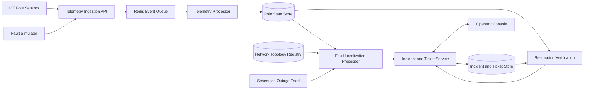

# Outage Localization System

A control-room system that turns incomplete and unreliable pole telemetry into a small number of trustworthy, geographically localized electricity-fault incidents.

The system identifies the most likely failed span, distribution transformer, or feeder; groups all affected poles into one incident; suppresses false alarms; manages the ticket lifecycle; and verifies restoration from field telemetry.

## Problem

Pole-mounted IoT devices report only whether their pole is energized. They do not report current, voltage magnitude, direction of flow, impedance, or wire condition.

A single upstream failure can make many downstream poles go dark. The system must determine the probable root fault instead of generating one alert per dark pole.

The central challenge is incomplete network topology:

* About 40% of distribution transformers have recorded pole ordering and parent relationships.
* About 60% have pole coordinates and transformer membership, but no reliable pole-to-pole sequence.

## Core capabilities

* Ingest `heartbeat`, `power_lost`, `power_restored`, and `boot` telemetry.

* Validate, deduplicate, and process late or out-of-order events.

* Maintain the latest best-known state of every pole.

* Detect span, transformer, and feeder faults.

* Distinguish likely sensor failures and scheduled outages from real faults.

* Localize faults using recorded or geographically inferred topology.

* Report localization precision and confidence with supporting evidence.

* Group downstream symptoms into one incident and ticket.

* Support the workflow:

  `detected → acknowledged → crew_assigned → resolved → verified → closed`

* Reject manual resolution when telemetry still shows affected poles as dark.

* Simulate faults, telemetry loss, duplicates, ordering issues, and restoration.

## Architecture at a glance



See [`ARCHITECTURE.md`](ARCHITECTURE.md) for the full design.

## Local startup

Start the foundation stack from a clean clone with one command:

```bash
docker compose up --build
```

Default entry points:

* Operator console: `http://localhost:3000`
* Backend health check: `http://localhost:8000/health`
* API documentation: `http://localhost:8000/docs`

The startup waits for PostgreSQL and Redis, runs the one-shot initializer, and
then starts the API, telemetry worker, and Nginx-served frontend. Stop the stack
without deleting its named volumes with:

```bash
docker compose down
```

To discard all local PostgreSQL and Redis data and rebuild the deterministic
demo state, remove the named volumes before starting again:

```bash
docker compose down --volumes
docker compose up --build
```

The first command permanently removes local development data.

## Development checks

All required tooling runs in Docker, so a host Python or browser installation is
not required:

```bash
make backend-lint
make backend-test
make frontend-check
make e2e
```

Run the complete backbone quality gate with:

```bash
make check
```

`make check` runs backend lint and tests, frontend lint/tests/build, and a
fresh-volume Playwright acceptance in an isolated Compose project. The isolated
stack uses temporary ports and volumes, so it does not replace a normally
running local application. `make acceptance-clean` runs only that clean-start
browser acceptance.

## Telemetry ingestion

The seeded devices can submit telemetry through the public API or the same-origin
Nginx proxy. For example:

```bash
curl --request POST http://localhost:3000/api/telemetry \
  --header 'Content-Type: application/json' \
  --data '{
    "device_id": "DEV-P-002",
    "pole_id": "P-002",
    "event": "power_lost",
    "energized": false,
    "ts": "2026-08-03T12:00:00Z",
    "seq": 101,
    "battery_mv": 3480,
    "rssi": -91,
    "fw": "1.4.2"
  }'
```

An accepted request returns HTTP 202 with generated event and correlation IDs.
The worker persists an immutable event, applies boot-generation and sequence
ordering, updates device health and current pole state transactionally, and only
then acknowledges the stream entry. Repeated event IDs are safe retries;
repeated or lower sequences remain in the audit history without regressing state.
After three failed deliveries, a poison entry moves to
`propel:telemetry:dead-letter`. Meaningful state changes schedule the affected DT
in `propel:analysis:due` with a ten-second debounce for VS-05.

## Incident and ticket API

After localization, the worker creates or updates one active incident for the
DT and boundary fingerprint and creates one `DETECTED` ticket. The operator API
provides:

* `GET /api/incidents`
* `GET /api/incidents/{incident_id}`
* `GET /api/tickets/{ticket_id}`
* `GET /api/network/poles?dt_id=DT-001`
* `GET /api/network/topology/DT-001`
* `POST /api/tickets/{ticket_id}/acknowledge`
* `POST /api/tickets/{ticket_id}/assign`
* `POST /api/tickets/{ticket_id}/resolve`

Operator transitions require an `actor`; assignment also requires
`assigned_crew`. Every accepted transition is appended to `ticket_events`.
`VERIFIED` and `CLOSED` are automatic-only states and manual attempts return
`AUTOMATIC_TRANSITION_ONLY`.

## Fault simulation

The simulator will support:

* Span fault
* Distribution-transformer fault
* Feeder fault
* Independent device failure
* Scheduled outage
* Missing `power_lost` messages
* Firmware 1.2 devices that become silent
* Duplicate and out-of-order events
* Multiple simultaneous faults
* Fault repair and restoration telemetry

A normal evaluation flow is:

1. Select a fault type and target.
2. Inject the fault.
3. Observe generated telemetry.
4. Wait for one localized incident and ticket.
5. Mark the ticket acknowledged and assign a crew.
6. Repair the simulated fault.
7. Observe restoration telemetry.
8. Confirm that the ticket is automatically verified and closed.

## Performance targets

| Metric                                             |                                Target |
| -------------------------------------------------- | ------------------------------------: |
| Fault occurrence to localized ticket visible in UI |                         `< 120 s` p95 |
| Sustained ingest throughput                        |                    `≥ 500 messages/s` |
| Burst handling                                     | `5,000 messages in 10 s` without loss |
| Incident-list load time                            |                               `< 2 s` |
| Restoration to automatic verification              |                             `< 120 s` |

Performance claims will be published only after measurement.

## Repository documents

The final repository will contain:

* `README.md` — setup, links, and project overview
* `ARCHITECTURE.md` — system design and localization logic
* `DEPLOYMENT.md` — deployment and troubleshooting
* `DECISIONS.md` — assumptions and technical decisions
* `AI-WORKFLOW.md` — AI tools used and validation process
* `docs/VERTICAL-SLICE.md` — the ordered backbone tracker to complete before the full backlog
* `docs/POST-BACKBONE.md` — PB-01 through PB-10 in delivery order with exit gates
* `docs/ACCEPTANCE.md` — the recorded backbone acceptance evidence and timings
* `AGENTS.md` — repository-wide coding standards and quality gates used by Codex

## Scope

Included:

* One city subdivision
* Telemetry ingestion and processing
* Fault detection, localization, classification, and grouping
* Ticket lifecycle and restoration verification
* Operator console
* Fault simulator

Not included:

* Crew routing or vehicle allocation
* Production authentication or role-based access control
* Mobile application
* Hardware or firmware implementation
* Predictive maintenance
* Historical analytics
* Multi-division operations

## Current status

VS-01 through VS-09 and PB-01 through PB-05 are complete. The tested system includes deterministic
startup, HTTP-to-Redis telemetry, idempotent Redis-to-PostgreSQL processing,
surveyed-span localization, one-incident grouping, audited ticket workflow,
telemetry-verified restoration, the operator console, and an isolated
fresh-volume Playwright acceptance, false-positive suppression, and deterministic
span/DT/feeder classification. Independent surveyed faults and missing-device
corridors now preserve separate incidents while degrading precision honestly.
Unknown-topology DTs now use a bounded deterministic geographic MST, persist edge
provenance and quality, and localize with probable-span, corridor, or DT-level
precision caps. Work resumes from PB-06 in `docs/POST-BACKBONE.md`; confidence
calibration, reliability hardening, load measurement, deployment, and demo packaging remain.
