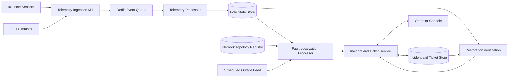

# Outage Localization System

A control-room system that turns incomplete and unreliable pole telemetry into a small number of trustworthy, geographically localized electricity-fault incidents.

The system identifies the most likely failed span, distribution transformer, or feeder; groups all affected poles into one incident; suppresses false alarms; manages the ticket lifecycle; and verifies restoration from field telemetry.

## Problem

Pole-mounted IoT devices report only whether their pole is energized. They do not report current, voltage magnitude, direction of flow, impedance, or wire condition.

A single upstream failure can make many downstream poles go dark. The system must determine the probable root fault instead of generating one alert per dark pole.

The central challenge is incomplete network topology:

* About 40% of distribution transformers have recorded pole ordering and parent relationships.
* About 60% have pole coordinates and transformer membership, but no reliable pole-to-pole sequence.

## Core capabilities

* Ingest `heartbeat`, `power_lost`, `power_restored`, and `boot` telemetry.

* Validate, deduplicate, and process late or out-of-order events.

* Maintain the latest best-known state of every pole.

* Detect span, transformer, and feeder faults.

* Distinguish likely sensor failures and scheduled outages from real faults.

* Localize faults using recorded or geographically inferred topology.

* Report localization precision and confidence with supporting evidence.

* Group downstream symptoms into one incident and ticket.

* Support the workflow:

  `detected → acknowledged → crew_assigned → resolved → verified → closed`

* Reject manual resolution when telemetry still shows affected poles as dark.

* Simulate faults, telemetry loss, duplicates, ordering issues, and restoration.

## Architecture at a glance



See [`ARCHITECTURE.md`](ARCHITECTURE.md) for the full design.

## Planned local startup

The completed repository must start from a clean clone with one command:

```bash
docker compose up --build
```

Planned default entry points:

* Operator console: `http://localhost:3000`
* Backend health check: `http://localhost:8000/health`
* API documentation: `http://localhost:8000/docs`

These values must be updated if the implementation uses different ports.

## Fault simulation

The simulator will support:

* Span fault
* Distribution-transformer fault
* Feeder fault
* Independent device failure
* Scheduled outage
* Missing `power_lost` messages
* Firmware 1.2 devices that become silent
* Duplicate and out-of-order events
* Multiple simultaneous faults
* Fault repair and restoration telemetry

A normal evaluation flow is:

1. Select a fault type and target.
2. Inject the fault.
3. Observe generated telemetry.
4. Wait for one localized incident and ticket.
5. Mark the ticket acknowledged and assign a crew.
6. Repair the simulated fault.
7. Observe restoration telemetry.
8. Confirm that the ticket is automatically verified and closed.

## Performance targets

| Metric                                             |                                Target |
| -------------------------------------------------- | ------------------------------------: |
| Fault occurrence to localized ticket visible in UI |                         `< 120 s` p95 |
| Sustained ingest throughput                        |                    `≥ 500 messages/s` |
| Burst handling                                     | `5,000 messages in 10 s` without loss |
| Incident-list load time                            |                               `< 2 s` |
| Restoration to automatic verification              |                             `< 120 s` |

Performance claims will be published only after measurement.

## Repository documents

The final repository will contain:

* `README.md` — setup, links, and project overview
* `ARCHITECTURE.md` — system design and localization logic
* `DEPLOYMENT.md` — deployment and troubleshooting
* `DECISIONS.md` — assumptions and technical decisions
* `AI-WORKFLOW.md` — AI tools used and validation process

## Scope

Included:

* One city subdivision
* Telemetry ingestion and processing
* Fault detection, localization, classification, and grouping
* Ticket lifecycle and restoration verification
* Operator console
* Fault simulator

Not included:

* Crew routing or vehicle allocation
* Production authentication or role-based access control
* Mobile application
* Hardware or firmware implementation
* Predictive maintenance
* Historical analytics
* Multi-division operations

## Current status

This document describes the intended build. Public deployment, demo-video, measured performance results, and final implementation-specific commands will be added before submission.
