# Post-backbone execution plan

This document is the ordered implementation plan after the VS-01 through VS-09
backbone. The backbone proves one surveyed span fault can travel through the
real API, Redis, worker, PostgreSQL, deterministic localizer, incident grouping,
ticket workflow, restoration verifier, and operator console.

The post-backbone objective is to broaden that proven path without weakening
its invariants. Work through PB-01 to PB-10 in order. Use [`tasks.md`](tasks.md)
as the complete backlog and this document as the delivery sequence.

## Product priorities

Optimize in this order:

1. Correct root-fault localization and grouping.
2. False-positive resistance.
3. Honest degradation when evidence or topology is weak.
4. Telemetry-verified restoration.
5. Reproducible tests and measured performance.
6. Operator clarity and deployability.

## Progress dashboard

- [x] PB-01 — Sensor anomaly and scheduled-outage suppression
- [x] PB-02 — DT and feeder fault classification
- [x] PB-03 — Multiple simultaneous surveyed faults
- [x] PB-04 — Missing-device corridors and degraded precision
- [x] PB-05 — Unknown-topology inference and localization
- [x] PB-06 — Confidence scoring and evidence calibration
- [x] PB-07 — Realistic multi-feeder network and telemetry generator
- [x] PB-08 — Batch ingestion, reliability, and measured performance
- [ ] PB-09 — Operator diagnostics and deployment hardening
- [ ] PB-10 — Release acceptance and submission packaging

## Dependency order

```mermaid
flowchart LR
    PB01["PB-01 False-positive suppression"] --> PB02["PB-02 DT and feeder faults"]
    PB02 --> PB03["PB-03 Simultaneous faults"]
    PB03 --> PB04["PB-04 Missing-device corridors"]
    PB04 --> PB05["PB-05 Inferred topology"]
    PB05 --> PB06["PB-06 Confidence calibration"]
    PB06 --> PB07["PB-07 Realistic generator"]
    PB07 --> PB08["PB-08 Performance and reliability"]
    PB08 --> PB09["PB-09 Diagnostics and deployment"]
    PB09 --> PB10["PB-10 Release acceptance"]
```



PB-01 through PB-04 complete correctness for surveyed networks. PB-05 adds the
unknown-topology path behind the same snapshot and localization interfaces.
PB-06 calibrates evidence only after all precision modes exist. PB-07 scales the
fixtures after the rules are deterministic. PB-08 measures the scaled system.
PB-09 exposes and deploys the proven behavior. PB-10 validates the release.

## Rules for every PB

A PB is complete only when:

- [ ] The behavior runs through the real modular-monolith path.
- [ ] Pure classification or localization rules have focused unit tests.
- [ ] PostgreSQL, Redis, or HTTP boundaries have integration coverage where relevant.
- [ ] A regression test protects every bug fixed during the PB.
- [ ] Error, retry, and degraded behavior are explicit.
- [ ] API schemas, migrations, configuration, and decisions are documented.
- [ ] Backend types, Ruff checks, frontend checks, and relevant tests pass.
- [ ] `make check` remains green from an isolated clean environment.
- [ ] No existing telemetry, localization, incident, or ticket invariant is weakened.

Do not add a new service, queue, event bus, state framework, or database unless a
PB requirement cannot be implemented clearly inside the current architecture.

---

## PB-01 — Sensor anomaly and scheduled-outage suppression

### Objective

Prevent two high-cost false positives before adding broader fault classes. An
isolated device problem must not look like a network outage, and a known planned
outage must not create a normal dispatch ticket.

### Implementation

- [x] Add immutable scheduled-outage domain values with UTC start/end windows,
      scope, source, and external identifiers.
- [x] Add the minimum Alembic migration and repository for scheduled-outage data.
- [x] Add deterministic scheduled-outage seed records and idempotent seed behavior.
- [x] Include relevant scheduled-outage matches in the analysis snapshot.
- [x] Classify an isolated dark pole with credible live descendants as
      `SENSOR_ANOMALY`.
- [x] Require evidence that separates a sensor anomaly from a terminal-pole fault.
- [x] Classify a candidate covered by an active planned window as
      `SCHEDULED_OUTAGE`.
- [x] Define overlap behavior for span, DT, and feeder outage scopes.
- [x] Suppress normal actionable ticket creation for both classifications.
- [x] Preserve the classification, evidence, suppression reason, and source in
      durable audit data.
- [x] Expose suppression state and reason through the incident/read API without
      presenting it as an active dispatch ticket.
- [x] Show a concise suppressed/anomaly state in the operator console.

### Required tests

- [x] One dark internal pole with fresh live descendants creates no span ticket.
- [x] A real terminal-pole loss is not automatically treated as a dead sensor.
- [x] Silence produces `STALE`, never `SENSOR_ANOMALY` or `DARK` by itself.
- [x] An active scheduled outage suppresses a matching normal fault ticket.
- [x] An expired, future, or non-overlapping schedule does not suppress a fault.
- [x] A genuine surveyed span fault still creates exactly one normal ticket.
- [x] Suppression decisions are deterministic when snapshot order changes.

### Exit condition

- [x] The fixed sensor-anomaly and scheduled-outage scenarios are explainable,
      auditable, and produce zero false normal dispatch tickets.

### Deliberately excluded

- External utility outage-feed integration
- Probabilistic sensor-failure models
- Operator-created schedules in the UI

---

## PB-02 — DT and feeder fault classification

### Objective

Extend deterministic classification from one span boundary to transformer-wide
and feeder-wide root faults while suppressing contained lower-level candidates.

### Implementation

- [x] Define snapshot evidence required for a `DT_FAULT`.
- [x] Define correlated evidence required for a `FEEDER_FAULT` across multiple DTs.
- [x] Add transformer and feeder candidate value types with stable fingerprints.
- [x] Add deterministic DT and feeder classifiers over immutable snapshots.
- [x] Implement precedence: feeder suppresses contained DT/span candidates.
- [x] Implement precedence: DT suppresses contained span candidates.
- [x] Keep independent branches outside the parent candidate unaffected.
- [x] Define degraded `UNCONFIRMED_OUTAGE` output when evidence is insufficient.
- [x] Persist and group DT/feeder candidates through the existing incident service.
- [x] Extend simulator commands for fixed DT and feeder faults through public telemetry.
- [x] Extend read APIs and the console for DT- and feeder-level assets.

### Required tests

- [x] All observable poles on one DT dark produce one DT incident.
- [x] Correlated losses across DTs on one feeder produce one feeder incident.
- [x] A feeder candidate suppresses every contained DT/span candidate.
- [x] A DT candidate suppresses every contained span candidate.
- [x] A span fault on an unrelated subtree remains independent.
- [x] Weak cross-DT timing produces `UNCONFIRMED_OUTAGE`, not a confident feeder fault.
- [x] Candidate fingerprints remain idempotent under replay and concurrency.

### Exit condition

- [x] Span, DT, feeder, and unconfirmed classifications obey deterministic
      precedence and create one incident per probable root fault.

---

## PB-03 — Multiple simultaneous surveyed faults

### Objective

Handle more than one real fault in the same analysis window without merging
independent roots or duplicating overlapping symptoms.

### Implementation

- [x] Generalize surveyed-tree traversal to return every independent boundary.
- [x] Assign each dark observation to the nearest retained root candidate.
- [x] Prevent one pole from inflating multiple affected-pole sets.
- [x] Apply DT/feeder precedence per contained subtree, not globally.
- [x] Define deterministic ordering for multiple returned candidates.
- [x] Extend incident persistence for concurrent independent fingerprints.
- [x] Extend simulator state to support multiple active faults on valid independent scopes.
- [x] Define injection conflicts for overlapping span, DT, and feeder targets.
- [x] Ensure repair and restoration close only the matching ticket.
- [x] Update the console to select and work multiple active incidents independently.

### Required tests

- [x] Two independent live-to-dark boundaries produce two incidents.
- [x] Many dark poles below each boundary still produce only two incidents.
- [x] Nested boundaries collapse according to precedence.
- [x] Two simultaneous persistence calls do not merge or duplicate incidents.
- [x] Repairing one fault leaves the other ticket active and dark.
- [x] Restoration telemetry closes only the repaired ticket.
- [x] Selection keeps list, map, evidence, and ticket actions synchronized.

### Exit condition

- [x] Independent surveyed roots remain separate through localization, incident
      grouping, operator actions, and restoration.

---

## PB-04 — Missing-device corridors and degraded precision

### Objective

Represent uncertainty honestly when surveyed electrical edges exist but one or
more poles cannot provide usable state evidence.

### Implementation

- [x] Distinguish `NO_DEVICE`, unhealthy, stale, and temporarily missing evidence.
- [x] Identify the last credible upstream live observation and first credible
      downstream dark observation around a gap.
- [x] Add a corridor value containing ordered bounding poles and skipped gaps.
- [x] Return `CORRIDOR` when a unique exact boundary cannot be proven.
- [x] Return `DT_LEVEL` when even a bounded corridor is not defensible.
- [x] Prevent missing evidence from being counted as dark corroboration.
- [x] Cap confidence according to precision and evidence quality.
- [x] Persist corridor geometry/evidence without inventing a surveyed span.
- [x] Render corridor and DT-level results distinctly on the map and detail panel.
- [x] Add simulator noise options for missing devices and omitted loss messages.

### Required tests

- [x] A missing boundary-child device degrades `EXACT_SPAN` to `CORRIDOR`.
- [x] Multiple unresolved gaps degrade to `DT_LEVEL` when appropriate.
- [x] A stale device is not treated as dark.
- [x] A known exact span remains exact when unrelated devices are missing.
- [x] Corridor endpoints and affected sets are deterministic.
- [x] The API never labels corridor evidence as a surveyed exact span.

### Exit condition

- [x] Every surveyed-network result is either exact or explicitly degraded, with
      no precision claim stronger than its observations support.

---

## PB-05 — Unknown-topology inference and localization

### Objective

Support the approximately 60% of DTs without trusted pole ordering by inferring
a radial working tree from coordinates while preserving provenance and strict
precision caps.

### Shared interface

```text
Analysis snapshot
        ↓
Topology provider
   ┌────┴─────┐
Surveyed    Inferred
   └────┬─────┘
        ↓
Deterministic boundary localizer
        ↓
Precision and confidence from provenance and evidence
```

### Implementation

- [x] Add one topology-provider protocol returning immutable rooted topology.
- [x] Keep the surveyed provider behavior unchanged behind that protocol.
- [x] Group unknown-topology poles by DT and validate coordinate bounds.
- [x] Generate bounded geographic candidate edges; do not construct an unbounded
      all-pairs graph for large DTs.
- [x] Score candidate edges using distance and available physical constraints.
- [x] Build and root a deterministic minimum spanning tree at the DT.
- [x] Record every inferred edge with source, distance, score, and topology version.
- [x] Compute overall topology quality and explain its limiting factors.
- [x] Reject disconnected, implausible, or cyclic inferred results honestly.
- [x] Run the same boundary-localization rules over inferred adjacency.
- [x] Prohibit `EXACT_SPAN` for every inferred result.
- [x] Return `PROBABLE_SPAN`, `CORRIDOR`, or `DT_LEVEL` according to topology and
      evidence quality.
- [x] Keep inferred topology visibly distinct in APIs and the operator map.
- [x] Preserve hidden simulator ground truth outside inference inputs.

### Evaluation

- [x] Measure exact-edge recovery against hidden ground truth.
- [x] Measure corridor containment when the exact edge differs.
- [x] Report topology quality separately from localization evidence confidence.
- [x] Use fixed seeds so every comparison is reproducible.
- [x] Record failure cases rather than tuning only to successful layouts.

### Required tests

- [x] The same coordinate fixture always produces the same rooted tree.
- [x] Inferred topology contains every eligible pole exactly once and has no cycle.
- [x] A known hidden fault is contained by the returned probable span or corridor.
- [x] No inferred result can produce `EXACT_SPAN`.
- [x] Weak or disconnected geography degrades to `DT_LEVEL` or a clear error.
- [x] Surveyed topology continues to take precedence when it exists.
- [x] Inference does not read simulator ground truth.

### Exit condition

- [x] Unknown-topology DTs produce reproducible, provenance-correct localization
      whose precision never exceeds measured topology quality.

---

## PB-06 — Confidence scoring and evidence calibration

### Objective

Finish a component-based evidence score that is explainable across every fault
class and precision level. The score is not a probability.

### Implementation

- [x] Define named score components for topology provenance, boundary evidence,
      downstream corroboration, temporal coherence, and sensor quality.
- [x] Define contradiction and missing-evidence penalties.
- [x] Apply hard maximum scores for `PROBABLE_SPAN`, `CORRIDOR`, and unbounded
      `DT_LEVEL` results while allowing rule-confirmed `DT_FAULT` evidence to score HIGH.
- [x] Define class-specific components for span, DT, feeder, anomaly, schedule,
      and unconfirmed results.
- [x] Keep pre-onset live telemetry as positive prior-state evidence.
- [x] Keep post-onset live descendants as contradictions where applicable.
- [x] Return component values, caps, penalties, positive reasons, and negative reasons.
- [x] Produce stable plain-language explanations without an LLM dependency.
- [x] Calibrate thresholds on fixed simulator seeds and retain raw results in
      [`PB06-CALIBRATION.json`](PB06-CALIBRATION.json).
- [x] Version the scoring policy so historical incidents remain interpretable.

### Required tests

- [x] Surveyed exact evidence scores higher than equivalent inferred evidence.
- [x] Hard precision caps cannot be bypassed by strong downstream counts.
- [x] Contradictions reduce the correct component deterministically.
- [x] Missing or unhealthy devices reduce evidence without becoming dark votes.
- [x] Reordering identical evidence does not change components or reasons.
- [x] Scores remain within documented bounds.
- [x] API and UI call the value an evidence score, never a probability.

### Exit condition

- [x] Every actionable or suppressed result explains its score, caps, positive
      evidence, and contradictions in stable operator language.

---

## PB-07 — Realistic multi-feeder network and telemetry generator

### Objective

Replace the four-pole demonstration as the only dataset with reproducible,
realistic subdivision-scale scenarios suitable for correctness and load tests.

### Network generation

- [x] Generate multiple substations/feeders, multiple DTs per feeder, branches,
      terminal poles, and varied radial depths.
- [x] Generate a configurable mix of surveyed and unknown-topology DTs.
- [x] Preserve hidden electrical ground truth separately from registry inputs.
- [x] Generate valid coordinates, PIN codes, transformer assignments, and versions.
- [x] Target a few thousand poles while retaining the four-pole backbone fixture.
- [x] Make every dataset reproducible from an explicit seed and configuration.
- [x] Validate connectivity, acyclicity, containment, and external-ID uniqueness.

### Device and telemetry generation

- [x] Model approximately 91% sensor coverage as configurable input.
- [x] Model independently offline devices without treating silence as darkness.
- [x] Include firmware 1.2 devices that may become silent on power loss.
- [x] Generate missing loss messages, duplicates, delays, and out-of-order events.
- [x] Generate span, DT, feeder, scheduled, and simultaneous faults.
- [x] Generate partial and complete restoration sequences.
- [x] Keep simulator physical state separate from derived application state.
- [x] Expose scenario manifests for evaluator comparison.

### Required tests

- [x] The same seed produces byte-for-byte equivalent logical ground truth.
- [x] Different seeds preserve all graph and identity invariants.
- [x] Surveyed/inferred proportions and sensor coverage match configured bounds.
- [x] Generated telemetry respects device bindings and sequence rules.
- [x] Fixed regression seeds cover every supported fault class and precision.
- [x] Generated scenarios run through public ingestion rather than direct state writes.

### Exit condition

- [x] A fixed scenario suite represents the target subdivision scale and every
      supported uncertainty mode reproducibly.

---

## PB-08 — Batch ingestion, reliability, and measured performance

### Objective

Measure and harden the real architecture at target scale without claiming
throughput or latency that has not been reproduced.

### Ingestion and worker work

- [x] Add bounded batch-ingestion schemas with per-item acceptance results.
- [x] Enforce request-byte, item-count, and field-size limits before allocation.
- [x] Preserve event-level IDs, correlation, validation errors, and idempotency.
- [x] Define retry behavior for partial batch acceptance and dependency failure.
- [x] Audit existing pending recovery, poison-event handling, and dead-letter data.
- [x] Add abandoned-message reclamation tests for the intended worker topology.
- [x] Exercise worker restart between database commit and Redis acknowledgement.
- [x] Verify stale scanning remains bounded at realistic pole counts.
- [x] Keep eligible simulator devices fresh through periodic public batch
      heartbeats while preserving modeled offline, missing, and faulted poles.
- [x] Return a stable domain error when a simulated scope has no telemetry
      emitters; never leave an incomplete active fault or raise from an empty set.
- [x] Add indexes only for measured slow access paths; PB-08 measurements did not
      justify another index.

### Full-scale map interaction

- [x] Keep subdivision overview rendering bounded by hiding pole markers and
      pole-to-pole spans below the detail zoom.
- [x] At detail zoom, render only poles and spans inside a padded viewport unless
      an operator explicitly selects a DT.
- [x] Preserve feeder and DT filters for intentional full-branch inspection.
- [x] Add browser acceptance checks for overview zoom response below 1.5 seconds
      per step and filtered DT rendering below 2 seconds on the recorded machine.
- [x] Record fault-to-visible and restoration-to-closed browser timings alongside
      the backend load measurements.

### Performance measurements

- [x] Create a recorded steady-state test for at least 500 messages/second.
- [x] Create a 5,000-message/10-second burst test with loss accounting.
- [x] Measure ingest acceptance, queue delay, processing delay, localization delay,
      incident-list response, and restoration verification separately.
- [x] Record machine/container limits, dataset seed, configuration, and commands.
- [x] Confirm no raw events, state transitions, incidents, or tickets are lost.
- [x] Confirm duplicate and stale traffic cannot regress current state under load.
- [x] Publish percentiles only from repeated measurements with sufficient samples.

### Required tests

- [x] Oversized batches fail with stable non-retryable errors.
- [x] Mixed-validity batches return deterministic item results.
- [x] Dependency failures return retryable responses without silent data loss.
- [x] Poison events retain bounded payloads and failure reasons.
- [x] The recorded steady and burst tests meet or honestly revise the target.

### Exit condition

- [x] Reliability behavior is proven under restart and failure, and every published
      performance statement links to [`PB08-PERFORMANCE.md`](PB08-PERFORMANCE.md).

---

## PB-09 — Operator diagnostics and deployment hardening

### Objective

Make the broadened system understandable in operations and reproducible in a
public deployment without moving domain decisions into the UI.

### Observability and diagnostics

- [x] Standardize structured log fields for correlation, device, pole, DT,
      feeder, incident, and ticket identifiers.
- [x] Expose bounded telemetry history and device-health diagnostics.
- [x] Surface database, Redis, worker lag, analysis retry, and dead-letter health.
- [x] Add operator views for suppressed events, topology provenance, corridor
      bounds, confidence components, and restoration evidence.
- [x] Distinguish loading, empty, stale, degraded, suppressed, and error states.
- [x] Keep raw telemetry secondary to the operator decision.
- [x] Add filters needed for multiple active incidents without adding analytics scope.

### Security and deployment

- [x] Keep simulator controls disabled or protected in the production design.
- [x] Validate security headers, request limits, CORS/proxy behavior, and secret handling.
- [x] Document every deployment environment variable and safe default.
- [x] Add Railway service configuration for frontend, API, worker, PostgreSQL, and Redis.
- [x] Run migrations and deterministic initialization safely during deployment.
- [x] Add deployment health checks and rollback/recovery instructions.
- [x] Preserve configurable tiles and OpenStreetMap attribution publicly.
- [ ] Run the acceptance smoke test against the deployed URL.

### Required tests

- [x] A dependency failure is visible in logs, health, and the console.
- [x] Diagnostic endpoints enforce pagination and bounded responses.
- [x] No secrets or unbounded telemetry payloads appear in logs.
- [ ] The public deployment starts from empty managed data services.
- [ ] The deployed operator workflow reaches telemetry-verified closure.

### Exit condition

- [ ] An operator can explain current system health and incident reasoning, and a
      reviewer can run the complete workflow on the public deployment.

---

## PB-10 — Release acceptance and submission packaging

### Objective

Freeze a reproducible release, validate every promised behavior, and package the
evidence needed for evaluation without adding new product scope.

### Final validation

- [ ] Run `make check` from a clean checkout.
- [ ] Run the few-thousand-pole deterministic seed from empty volumes.
- [ ] Execute fixed surveyed, inferred, anomaly, schedule, DT, feeder, simultaneous,
      gap, duplicate, stale, firmware-silence, and partial-restoration scenarios.
- [ ] Confirm incident and ticket counts against hidden simulator ground truth.
- [ ] Confirm no inferred result claims `EXACT_SPAN`.
- [ ] Confirm every operator repair still requires fresh restoration telemetry.
- [ ] Re-run and archive the recorded performance suite.
- [ ] Confirm the public deployment matches the release configuration.
- [ ] Record known limitations and any targets not met.

### Documentation and submission

- [ ] Finalize README setup, architecture, decisions, API, deployment, troubleshooting,
      performance, acceptance, and AI-workflow documentation.
- [ ] Ensure a reviewer can start locally with one documented command.
- [ ] Provide stable evaluator scenarios and expected outputs.
- [ ] Record a five-minute demo showing fault injection, localization evidence,
      grouping, ticket workflow, repair, and automatic closure.
- [ ] Include surveyed and inferred examples with honest precision differences.
- [ ] Verify no secrets, generated production data, or local artifacts are committed.
- [ ] Tag or otherwise identify the accepted release revision.

### Exit condition

- [ ] A reviewer can reproduce the release locally or publicly, verify the main
      correctness claims, and understand every documented limitation.

---

## Optional extension after PB-10

An operator-facing AI incident summary may be added only after the deterministic
release passes. The model receives already-decided structured evidence and may
summarize it; it must never choose classification, location, precision,
confidence, ticket transitions, or restoration state. A deterministic summary
remains the required fallback.

## Explicitly outside this plan

- Production identity and role-based authorization
- Crew routing or dispatch optimization
- Mobile applications
- Historical analytics and predictive maintenance
- Learned topology or learned fault classification
- Kafka, PostGIS, Kubernetes, graph databases, and microservice decomposition
- Multi-subdivision tenancy
